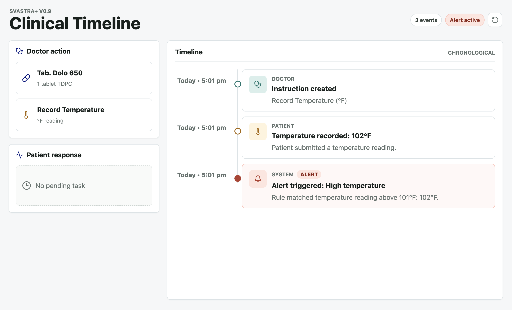

<p align="center">
  
</p>

# BC2RI Clinical Timeline

Timeline-first clinical workflow prototype for the BC2RI LLP Svastra+ v0.9 assessment.

Core flow:

- Doctor creates a medication instruction or temperature task
- Patient responds to the active task
- Events render chronologically on a clinical timeline
- Alert events are created automatically when the rule matches

## Live Demo

Frontend:
https://clinical-timeline-interaction.vercel.app/

Backend API:
https://intelligent-energy-production-496d.up.railway.app

API Docs:
https://intelligent-energy-production-496d.up.railway.app/docs



## Setup

Install frontend dependencies:

```bash
npm install
```

Create and activate a Python virtual environment, then install the API dependencies:

```bash
python3 -m venv .venv
source .venv/bin/activate
pip install -r requirements.txt
```

Run the app:

```bash
npm run dev
```

Open:

```text
http://localhost:5173
```

The FastAPI backend runs at `http://127.0.0.1:8000`.

By default, the frontend uses same-origin `/api` calls. For a split deployment where the API lives on Railway, set:

```bash
VITE_API_BASE_URL=https://intelligent-energy-production-496d.up.railway.app
```

## Architecture

- `src/App.tsx` contains the React prototype UI and client-side interaction state.
- `src/styles.css` contains the responsive timeline layout and visual system.
- `backend/app/main.py` contains the FastAPI API, storage adapter, and alert rules.
- `backend/data/store.json` is created at runtime and intentionally ignored by git.
- `api/index.py` exposes the FastAPI app to Vercel Functions.
- `vercel.json` defines the Vercel build.
- `.github/workflows/ci.yml` runs frontend and backend validation.

The frontend calls the backend through Vite's `/api` proxy during development. The backend returns the full task/event state after every mutation, keeping the client logic small and predictable.

## Storage

The API uses PostgreSQL automatically when `DATABASE_URL` or `POSTGRES_URL` is available, which is the intended Railway deployment path. The prototype state is stored as a single JSONB document in `clinical_timeline_store`, keeping the implementation small while making demo data persistent across deploys.

Without a database URL, the API falls back to local JSON storage at `backend/data/store.json`.

## API Shape

- `GET /api/state` returns tasks and timeline events.
- `POST /api/tasks` creates either a medication instruction or a temperature task.
- `POST /api/tasks/{task_id}/medication` records `taken` or `not_taken`.
- `POST /api/tasks/{task_id}/temperature` records a Fahrenheit value.
- `POST /api/reset` clears local demo state.

## Alert Rules

- Medication marked as `not_taken` creates an alert event.
- Temperature greater than `101°F` creates an alert event.

## Validation

Run the frontend build:

```bash
npm run build
```

Run backend tests:

```bash
pip install -r requirements-dev.txt
python -m pytest backend/tests
```

The test suite covers the medication alert, temperature alert, non-alert temperature threshold, input validation, duplicate responses, and pending-task sequencing.

## Assumptions

- This is a single-case prototype with no authentication.
- Only one patient task is active at a time.
- Railway uses PostgreSQL for persistent demo state; local development can use JSON fallback.
- Timestamps are stored as UTC ISO strings and rendered in the browser's local time.
- Completed timelines can be cleared with reset for a fresh demo.
